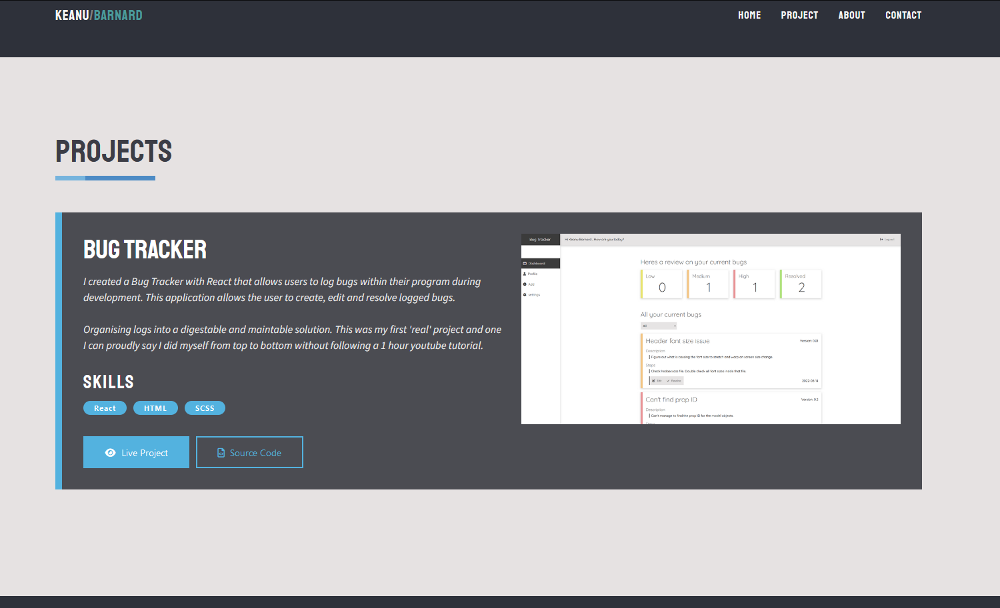

<h1>My Portfolio Website</h1>
This is my portfolio website which I produced with HTML, CSS/SCSS and React. Its a single page website that uses React-scroll, AOS animations and other packages to create a clean finish. 

<h3>What I used</h3>
My main languages 
 
- Javascript 
 
- React
  
- HTML
 
- CSS/SCSS
 
Packages used 
 
- AOS Animations
 
- EmailJS
 
- React-Scroll

<h3> Styling </h3> 
All the styling on this page was done by me. I took inspiration from multiple websites and went from there.  
<h4> How I set up my stylesheets </h4>
With no profesional experience working with CSS/SCSS I tried a method that I felt worked for me. Which was using scss partials to store all of my variables. Then if a component style sheet need to access a particular colour or font. You just had to reference those variables such as light text colours, accent colours and font types. I also used my 'App.scss' sheet to be somewhat of a general style component in which other components could reference. Such as container widths, button styles and header styles.

<h3> Animations </h3>
To handle all the scroll animations I used the AOS Animations package along with React-Scroll to create the smooth animations. When the user clicks on the link it will smooth scroll to the component location with React-scroll. As it scrolls the components will fade in based on the animation type. Defined by 'data-aos'

<h3> Contact Me Section </h3>
To handle my contact page I used EmailJs, was super simple to set up and had it working in no time. Just intergrated in with a quick modal pop up and some standard HTML validation to avoid any errors and it was ready to go. 

This website roughly took me about 15 hours to complete in total recorded time to get to the first initial commit which included all the main functionality, styles and responsiveness.
